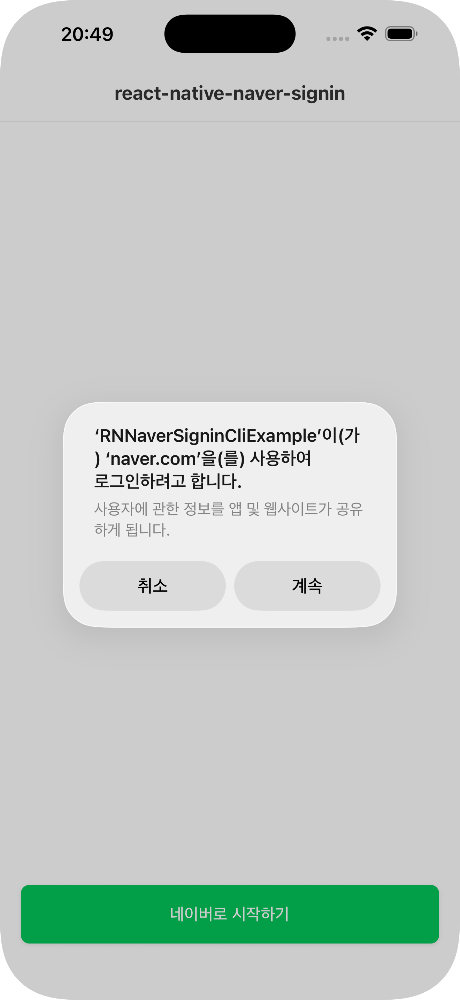
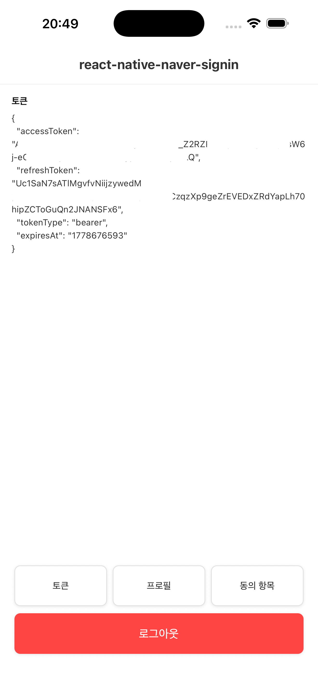
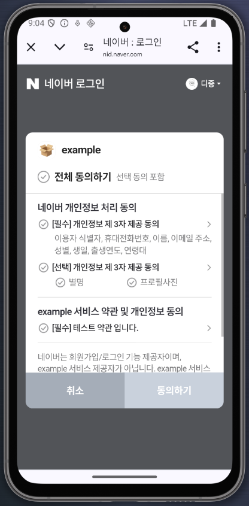
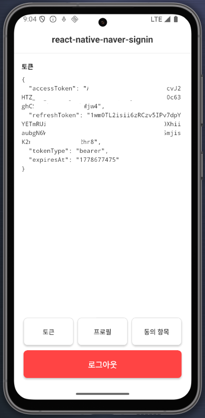

<div align="center">

# @package-kr/react-native-naver-signin

[](https://www.npmjs.com/package/@package-kr/react-native-naver-signin)
[](https://www.npmjs.com/package/@package-kr/react-native-naver-signin)


React Native 전용 네이버 로그인 라이브러리 입니다.

<p align="center">
  
  &nbsp;&nbsp;&nbsp;&nbsp;&nbsp;&nbsp;&nbsp;&nbsp;&nbsp;&nbsp;
  
  &nbsp;&nbsp;&nbsp;&nbsp;&nbsp;&nbsp;&nbsp;&nbsp;&nbsp;&nbsp;
  <br/>
  
  &nbsp;&nbsp;&nbsp;&nbsp;&nbsp;&nbsp;&nbsp;&nbsp;&nbsp;&nbsp;
  
</p>

</div>

## Getting started

해당 라이브러리는 React Native `0.76` 이상을 지원합니다.<br/><br/>
`TurboModule` 기반으로 구현되어 있어 `New Architecture`를 지원하며,<br/>
`Auto Linking`이 적용되어 있어 별도 네이티브 모듈 연결 작업이 필요 없습니다.<br/>

`Expo`와 `React Native CLI` 프로젝트 모두 지원합니다.

## Prerequisites

라이브러리를 사용하려면 먼저 [네이버 개발자 센터](./docs/NAVER_CONSOLE_SETUP.md)에서 앱 등록과 플랫폼 설정을 완료해야 합니다.

## Installation

```sh
npm install @package-kr/react-native-naver-signin
```

## React Native CLI

### iOS

#### 1. Info.plist 설정

`ios/{ProjectName}/Info.plist`에서 `{NAVER_CLIENT_ID}`, `{NAVER_CLIENT_SECRET}`, `{NAVER_URL_SCHEME}` 부분을 교체해주세요.<br/>
URL scheme은 네이버 개발자 센터에 등록한 값과 동일해야 합니다. `NAVER_APP_NAME`은 선택값이며, 없으면 앱 이름(`CFBundleDisplayName` 또는 `CFBundleName`)을 사용합니다.

<details>
<summary>복사용</summary>

```xml
	<key>CFBundleURLTypes</key>
	<array>
		<dict>
			<key>CFBundleTypeRole</key>
			<string>Editor</string>
			<key>CFBundleURLName</key>
			<string>NAVER</string>
			<key>CFBundleURLSchemes</key>
			<array>
				<string>{NAVER_URL_SCHEME}</string>
			</array>
		</dict>
	</array>
	<key>NAVER_CLIENT_ID</key>
	<string>{NAVER_CLIENT_ID}</string>
	<key>NAVER_CLIENT_SECRET</key>
	<string>{NAVER_CLIENT_SECRET}</string>
	<key>NAVER_URL_SCHEME</key>
	<string>{NAVER_URL_SCHEME}</string>
	<key>LSApplicationQueriesSchemes</key>
	<array>
		<string>naversearchapp</string>
		<string>naversearchthirdlogin</string>
	</array>
```

</details>

```diff
	<!-- Info.plist -->
+	<key>CFBundleURLTypes</key>
+	<array>
+		<dict>
+			<key>CFBundleTypeRole</key>
+			<string>Editor</string>
+			<key>CFBundleURLName</key>
+			<string>NAVER</string>
+			<key>CFBundleURLSchemes</key>
+			<array>
+				<string>{NAVER_URL_SCHEME}</string>
+			</array>
+		</dict>
+	</array>
+	<key>NAVER_CLIENT_ID</key>
+	<string>{NAVER_CLIENT_ID}</string>
+	<key>NAVER_CLIENT_SECRET</key>
+	<string>{NAVER_CLIENT_SECRET}</string>
+	<key>NAVER_URL_SCHEME</key>
+	<string>{NAVER_URL_SCHEME}</string>
+	<key>LSApplicationQueriesSchemes</key>
+	<array>
+		<string>naversearchapp</string>
+		<string>naversearchthirdlogin</string>
+	</array>
```

#### 2. AppDelegate 설정

`ios/{ProjectName}/AppDelegate.swift`에 네이버 로그인 URL 처리 코드를 추가합니다.

> **Expo 사용자는 이 단계를 건너뛰세요.** Config Plugin이 자동으로 처리합니다.

```swift
import React
import RNNaverSignin

// AppDelegate 클래스 안에 메서드 추가 또는 기존 메서드 앞부분에 네이버 처리 추가
func application(
  _ app: UIApplication,
  open url: URL,
  options: [UIApplication.OpenURLOptionsKey: Any] = [:]
) -> Bool {
  if RNNaverSignin.handleOpen(url) {
    return true
  }

  return RCTLinkingManager.application(app, open: url, options: options)
}
```

#### 3. CocoaPods 설치

```sh
cd ios && pod install
```

### Android

#### 1. 네이버 클라이언트 정보 설정

`app/src/main/res/values/strings.xml`에 네이버 클라이언트 정보를 추가합니다.
앱 이름은 기본적으로 기존 `app_name` 값을 사용하므로 별도 `naver_app_name`은 선택사항입니다.

```diff
  <resources>
      <string name="app_name">YourAppName</string>
+     <string name="naver_client_id">{NAVER_CLIENT_ID}</string>
+     <string name="naver_client_secret">{NAVER_CLIENT_SECRET}</string>
  </resources>
```

## Expo

### 1. Config Plugin 설정

`app.json` 또는 `app.config.js`에 플러그인을 추가합니다.

```json
{
  "expo": {
    "plugins": [
      [
        "@package-kr/react-native-naver-signin",
        {
          "naverClientId": "{NAVER_CLIENT_ID}",
          "naverClientSecret": "{NAVER_CLIENT_SECRET}",
          "naverUrlScheme": "{NAVER_URL_SCHEME}"
        }
      ]
    ]
  }
}
```

> Info.plist 설정과 AppDelegate 코드 주입이 자동으로 처리됩니다.
> `naverUrlScheme`을 생략하면 `naverlogin{NAVER_CLIENT_ID}` 형식으로 자동 생성됩니다.

### 2. 빌드

```sh
npx expo prebuild --clean
npx expo run:ios
npx expo run:android
```

## Usage

더 많은 사용 예제는 [RNNaverSigninCliExample](https://github.com/Package-KR/react-native-naver-signin/tree/main/example/RNNaverSigninCliExample)와 [RNNaverSigninExpoExample](https://github.com/Package-KR/react-native-naver-signin/tree/main/example/RNNaverSigninExpoExample) 프로젝트를 참고해주세요.

```ts
import { login, logout, deleteAccount, getProfile, getAgreement } from '@package-kr/react-native-naver-signin';

// 네이버 앱을 먼저 사용하고, 사용할 수 없으면 인앱 웹 기반 로그인으로 전환됩니다.
const token = await login();

// 로그아웃
await logout();

// 회원탈퇴
await deleteAccount();

// 프로필 조회
const profile = await getProfile();

// 동의 항목 조회
const agreement = await getAgreement();
```

`getProfile()`과 `getAgreement()`는 네이티브 SDK가 저장한 현재 액세스 토큰을 사용하므로 별도 토큰 인자를 받지 않습니다.

---

## Methods

| 메서드            | 설명                                                                            | Returns                    |
| ----------------- | ------------------------------------------------------------------------------- | -------------------------- |
| `login()`         | 네이버 앱을 먼저 사용하고, 사용할 수 없으면 인앱 웹 기반 로그인으로 전환됩니다. | `Promise<NaverOAuthToken>` |
| `logout()`        | 로그아웃합니다.                                                                 | `Promise<string>`          |
| `deleteAccount()` | 네이버 계정 연동을 해제합니다.                                                  | `Promise<string>`          |
| `getProfile()`    | 사용자 프로필을 조회합니다.                                                     | `Promise<NaverProfile>`    |
| `getAgreement()`  | 네이버 동의 항목 정보를 조회합니다.                                             | `Promise<NaverAgreement>`  |

---

## Types

### `NaverOAuthToken`

| 필드           | 타입     | 설명                                       |
| -------------- | -------- | ------------------------------------------ |
| `accessToken`  | `string` | 액세스 토큰                                |
| `refreshToken` | `string` | 리프레시 토큰                              |
| `tokenType`    | `string` | 토큰 타입                                  |
| `expiresAt`    | `string` | 토큰 만료 시각. Unix seconds 문자열입니다. |

### `NaverProfile`

| 필드           | 타입                          | 설명              |
| -------------- | ----------------------------- | ----------------- |
| `id`           | `string \| null \| undefined` | 사용자 고유 ID    |
| `nickname`     | `string \| null \| undefined` | 닉네임            |
| `name`         | `string \| null \| undefined` | 이름              |
| `email`        | `string \| null \| undefined` | 이메일            |
| `profileImage` | `string \| null \| undefined` | 프로필 이미지 URL |
| `gender`       | `string \| null \| undefined` | 성별 (M/F)        |
| `age`          | `string \| null \| undefined` | 연령대            |
| `birthday`     | `string \| null \| undefined` | 생일 (MM-DD)      |
| `birthyear`    | `string \| null \| undefined` | 출생 연도         |
| `mobile`       | `string \| null \| undefined` | 휴대폰 번호       |

### `NaverAgreement`

| 필드             | 타입                   | 설명           |
| ---------------- | ---------------------- | -------------- |
| `result`         | `string`               | API 처리 결과  |
| `accessToken`    | `string`               | 액세스 토큰    |
| `agreementInfos` | `NaverAgreementInfo[]` | 동의 항목 목록 |

### `NaverAgreementInfo`

| 필드        | 타입     | 설명          |
| ----------- | -------- | ------------- |
| `termCode`  | `string` | 약관 코드     |
| `clientId`  | `string` | 클라이언트 ID |
| `agreeDate` | `string` | 동의 일시     |

### `NaverSigninError`

| 코드                                    | 설명                                                                      |
| --------------------------------------- | ------------------------------------------------------------------------- |
| `NAVER_ACTIVITY_DOES_NOT_EXIST`         | Android 현재 Activity를 찾을 수 없습니다.                                 |
| `NAVER_AGREEMENT_FAILED`                | 네이버 동의 항목 조회에 실패했습니다.                                     |
| `NAVER_DELETE_FAILED`                   | 네이버 계정 연동 해제에 실패했습니다.                                     |
| `NAVER_ERROR` / `NAVER_ERROR_${number}` | SDK 또는 네이티브 계층에서 반환한 기타 오류입니다.                        |
| `NAVER_INVALID_CLIENT`                  | 네이버 콘솔의 client ID, bundle/package, URL scheme 설정이 맞지 않습니다. |
| `NAVER_LOGIN_FAILED`                    | 네이버 로그인에 실패했습니다.                                             |
| `NAVER_MISCONFIGURED`                   | 앱에 필요한 네이버 설정값이 누락됐습니다.                                 |
| `NAVER_NOT_LOGGED_IN`                   | 로그인되지 않은 상태에서 토큰이 필요한 API를 호출했습니다.                |
| `NAVER_PROFILE_FAILED`                  | 네이버 프로필 조회에 실패했습니다.                                        |
| `NAVER_REQUEST_IN_PROGRESS`             | 로그인 또는 연동 해제 요청이 이미 진행 중입니다.                          |
| `NAVER_REQUEST_TIMEOUT`                 | SDK 콜백이 제한 시간 안에 돌아오지 않아 요청을 정리했습니다.              |

## 네이버 SDK 버전 오버라이드

기본적으로 iOS SDK `4.2.3`, Android SDK `5.10.0`을 사용합니다. 호스트 앱에서 다른 버전을 사용해야 하는 경우 아래와 같이 오버라이드할 수 있습니다.

### Expo

`app.json`에서 플랫폼별 SDK 버전을 각각 지정합니다. iOS와 Android SDK는 버전 체계가 다르므로 같은 값을 양쪽에 넣지 마세요.

```json
{
  "expo": {
    "plugins": [
      [
        "@package-kr/react-native-naver-signin",
        {
          "naverClientId": "{NAVER_CLIENT_ID}",
          "naverClientSecret": "{NAVER_CLIENT_SECRET}",
          "naverUrlScheme": "{NAVER_URL_SCHEME}",
          "overrideNaverIosSDKVersion": "4.2.3",
          "overrideNaverAndroidSDKVersion": "5.11.0"
        }
      ]
    ]
  }
}
```

### CLI (iOS)

`ios/Podfile` 상단에 전역변수를 선언합니다.

```ruby
$NaverSDKVersion = "4.2.3"
```

### CLI (Android)

`android/build.gradle`의 `ext` 블록에 속성을 추가합니다.

```gradle
buildscript {
    ext {
        naverSdkVersion = "5.11.0"
    }
}
```

## 라이선스

MIT

## QA

배포 전 기준으로 아래 항목을 확인합니다.

| 항목                     | 상태                                                |
| ------------------------ | --------------------------------------------------- |
| TypeScript 타입 검사     | 준비됨                                              |
| Expo config plugin build | 준비됨                                              |
| CLI iOS/Android 예제     | 예제 설정 완료, 실제 Client ID/Secret 필요          |
| Expo iOS/Android 예제    | config plugin 설정 완료, 실제 Client ID/Secret 필요 |
